# Note: "Deep Reinforcement Learning: An Overview"

## Introduction

This is a note of [Deep Reinforcement Learning: An Overview, Yuxi Li](paper.pdf).

I will focus on Chapter 1~3, which contain the core concepts in reinforcement learning.

This note only lists the most important concepts in this paper. 
Most of the ideas may not be elaborated. Instead, only key words are mentioned in the note.

To understand more about the details of reinforcement learning, please scrutinize the paper.

P.S.

1. The version of the paper this note takes on may not be the latest. 
   To access the latest version of paper, please refer to [here](https://arxiv.org/pdf/1701.07274.pdf).
1. Some important concepts that are not covered by the paper may also be included in this note.
   The materials are also listed in Reference. 

## Machine Learning

### Category

 * Supervised learning
   * Classification 
   * Regression
 * Unsupervised learning: representation learning
   * Clustering 
   * Density estimation
 * Reinforcement learning

### Elements

 * Dataset
   * Non-overlapping training, validation and testing subsets
 * Cost/Loss function
   * Category
     * Training error measures the error on the training data
     * Generalization error, or test error, measures the error on new input data
   * Measurement
     The following measurements are equivalent.
     * Maximum likelihood estimation (MLE)
	 * Minimize KL divergence
	 * Minimize the cross-entropy
	 * negative log-likelihood (NLL)
 * Optimization procedure
   * Gradient descent 
   * Stochastic gradient descent
 * Model

## Deep Learning

### Algorithms

 * Linear regression
 * Logistic regression
 * Support vector machine (SVM)
 * Decision tree
 * Boosting

### Elements

 * Input layer
 * Output layer
 * Hidden layers

### Activation Function

 * Logistic
 * tanh
 * Rectified linear unit (ReLU)

### Networks

 * Multilayer perceptron (MLP)
 * Convolutional neural network (CNN)
 * Recurrent neural network (RNN)
   * Long short term memory network (LSTM)
   * Gated recurrent unit (GRU)

### Others

 * Gradient backpropagation: used for training all deep neural networks
 * Dropout
 * Batch normalization: normalize each training mini-batch to accelerate training by 
   reducing internal covariate shift

## Reinforcement Learning

### Fundamental Elements

 * State: 
 
 * Policy: 
 
 * Reward: 
 
   

### Value Function

 The following decomposition uses [Bellman equation](https://en.wikipedia.org/wiki/Bellman_equation).

 * State value
 
   
   
 * Optimal state value: 
 
   
   
   
 
 * Action value
 
   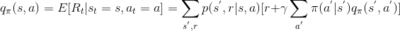
   
 * Optimal action value
 
   
   
### Temporal Difference (TD) Learning

 * Markov Decision Process (MDP): satisfy Markov property, 
   i.e., the future depends only on the current state and action, but not on the past  
 
 * If RL problem satisfies the Markov property, it is defined by the 5-tuple .
 
 * TD learning is usually refer to the learning methods for value function evaluation
 
 * Update rule
 
   
   
 * TD error
 
   
 
 * Some tabular algorithms
 
   
   
   
   
   
 
 * Algorithm with function approximation
 
   
 
 * **It is still unclear what is the root cause for instability. 
   There are still many open problems in off-policy learning.**

### Policy Optimization

 * Advantage: 
 
   Here the value function V(s) is the baseline.

 * REINFORCE: an policy-based algorithm.
 
   
 
 * Actor-Critic: the critic updates action-value function parameters, 
   and the actor updates policy parameters, in the direction suggested by the critic.
 
   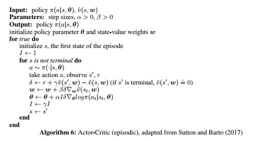
 
 * **The distinct difference between a "shallow" RL and a deep RL is what function approximator is used.**

### Reinforcement Learning Parlance

#### Problems

 * Prediction problem (policy evaluation): compute the state or action value function for a policy
 * Control problem: find the optimal policy
 * Planning problem: construct a value function or a policy with a model
 
#### Policy

 * On-policy: evaluate or improve the behavioural policy (same-policy)
 * Off-policy: learn an optimal value function or policy, maybe following an unrelated behavioural policy 
   (different-policy)

#### Others

 * Exploration-exploitation dilemma: The agent needs to exploit the currently best action, 
   yet it has to explore the environment to find better actions.
 * Model-free: The agent learn with trail-and-error from experience explicitly. 
   The model is not known or learned from experience.
 * Online mode: Models are trained on data acquired in sequence
 * Offline mode (batch mode): Models are trained on the entire data set.
 * Bootstrapping: an estimate of state or action value is updated from subsequent estimates.

## Value Function

### [Q-Learning](https://link.springer.com/content/pdf/10.1007%2FBF00992698.pdf)

#### Algorithm

 
 
#### Drawback
 
 * The maximum term cannot be easily obtained.

### [Deep Q-Network (DQN)](https://storage.googleapis.com/deepmind-media/dqn/DQNNaturePaper.pdf)

#### Algorithm
 
 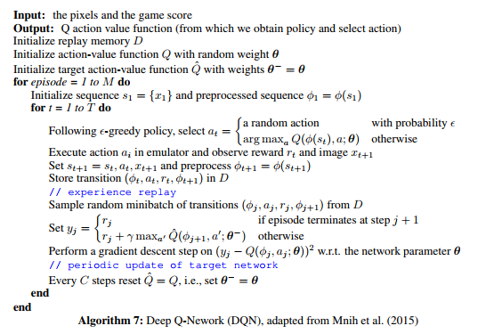

#### Contributions

 * Stabilize the training of action value function approximation with CNN using experience replay and target network
 * Design an end-to-end RL approach, with only the pixels and the game score as inputs, 
   so that only minimal domain knowledge is required
 * Train a flexible network with the same algorithm, network architecture and hyperparameters to perform well on 
   many different tasks

### [Double Deep Q-Network (Double DQN)](https://arxiv.org/pdf/1509.06461.pdf)

 * Update rule
 
   
   
   where the target 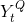 is defined as
   
   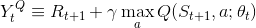
  
 * Deep Q-Network target function
 
   
   
   is equivalent to 
   
   
 
 * In deep Q-Network, both selection and evaluation use the same network, 
   making it easily to overestimate the values of the actions. Thus, double deep Q-Network is proposed.
   
 * Double Deep Q-Network target function
 
   
 
 * Double deep Q-Network uses two sets of parameters for Q function, 
    for selection and  for evaluation.
   The second set of weights can be updated symmetrically by switching the roles of 
    and . 
 
 * Compare with Nature DQN
 
   * Nature DQN: Old Q for action selection, current Q for action evaluation
   * Double DQN: Current Q for action selection, old Q for action evaluation 
   
### [Prioritized Experience Replay](https://arxiv.org/pdf/1511.05952.pdf)

 

 * Use importance sampling to make experience replay more efficient and effective
 * The priority is gained from TD error
 * Use Sum Tree to do the sampling efficiently. For more details, please refer to 
   [here](https://morvanzhou.github.io/tutorials/machine-learning/reinforcement-learning/4-6-prioritized-replay/).

### [Dueling Architecture](https://arxiv.org/pdf/1511.06581.pdf)

 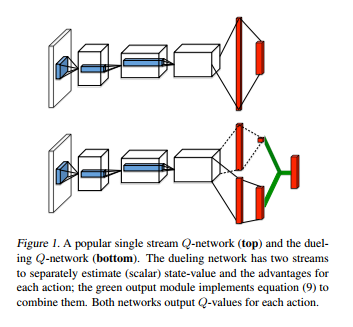

 * The lower layers of the dueling network are convolutional as in the original DQNs
 * Use two sequences of fully connected layers to estimate state value function V(s) and 
   associated advantage function A(s, a)
 * Then, combine them to estimate action value function Q(s, a)
 * Converge faster than Q-learning

## Policy

### [REINFORCE](https://link.springer.com/content/pdf/10.1007%2FBF00992696.pdf)
 
 
   
 * A policy gradient method
     
### [Actor-Critic](https://papers.nips.cc/paper/1786-actor-critic-algorithms.pdf)
 
 
 
 * Actor-only methods drawbacks
   * Large variance
   * New gradient is estimated independently of past estimates.
 * Critic-only methods drawbacks
   * Do not try to optimize directly over a policy space
      
### [Deterministic Policy Gradient (DPG)](http://proceedings.mlr.press/v32/silver14.pdf)
 
 * Stochastic policy gradient needs to sample from the distribution.
 * DPG's gradient is deterministic, which is the expected gradient of the action-value function.
 * In continuous action spaces, sampling the distribution is inefficient.
   DPG, on the other hand, can be done much more efficiently than the stochastic policy gradient.
     
### [Deep Deterministic Policy Gradient (DDPG)](https://arxiv.org/pdf/1509.02971.pdf)

 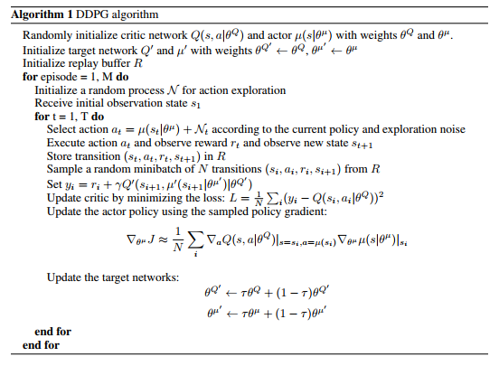

 * Combine DQN and DPG together
   * DQN was originally used in concrete action spaces
   * DPG was proposed to deal with continuous action space problems
   * DDPG performs better than DPG  
     
### [Asynchronous Advantage Actor-Critic (A3C)](https://arxiv.org/pdf/1602.01783.pdf)

 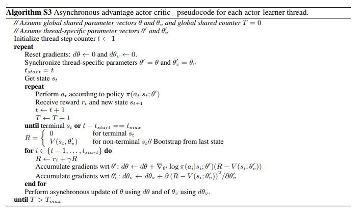

 * A3C asynchronously executes multiple agents in parallel 
   * The combination of RL with deep neural networks was thought to be unstable. 
     However, A3C can decorrelate the agent's data into a more stationary process.
   * A3C is able to run on a single machine with a standard multi-core CPU. 
     
### [Trust region policy optimization (TRPO)](https://arxiv.org/pdf/1502.05477.pdf)
 
 * By mathematical proof, we can derive that 
 
   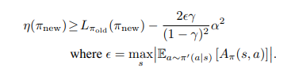.
 
 * Then, ideally we can use the following algorithm to iteratively update policy.
 
   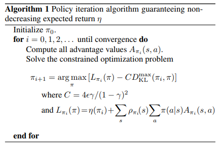
 
 * The paper then do the following tricks to make the algorithm practical. 
   * Introduce a trust region constraint. 
   * Approximate the trust region constraint by the average KL divergence constraint.
   * Replace the expectations and Q value in the optimization problem by sample estimates, single path approach and 
     vine approach.
   * Solve the constrained optimization problem approximately to update the policy’s parameter vector.
     
### [Proximal Policy Optimization (PPO)](https://arxiv.org/pdf/1707.06347.pdf)
 
 * TRPO is complicated and not compatible with architectures that include noise or parameter sharing.
 * PPO is proposed to improve TRPO.
   * Have the stability and reliability of trust-region methods 
   * Much simpler to implement 
   * Applicable in more general settings
   * Have better overall performance
 * Original surrogate objective
 
 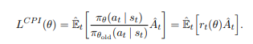
 
 * Clipped surrogate objective
 
 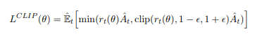
 
 * KL-penalized objective
 
 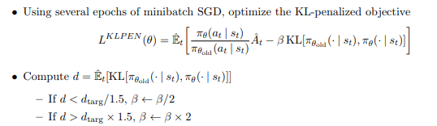
 
 * Performance: clipped > KL-penalized > original
 * Algorithm:
 
 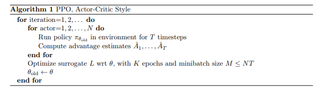
 
 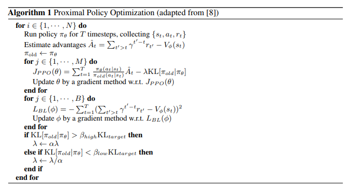
   
### [Distributed Proximal Policy Optimization (DPPO)](https://arxiv.org/pdf/1707.02286.pdf)
 
 * Combine PPO with A3C
 * Algorithm:
 
 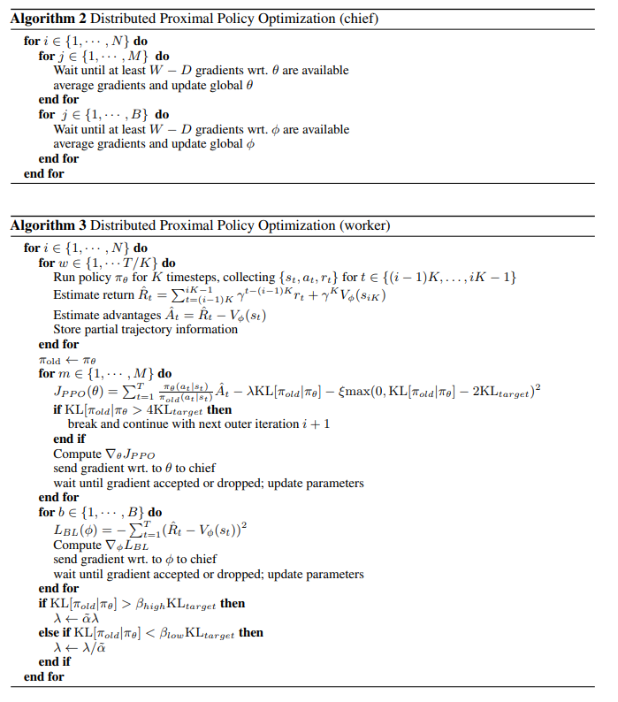

## Reward

### Category

 * Reward functions not available for RL problem
   * Behavioral cloning (apprenticeship learning / Learning from demonstration)
     * Supervised: state -> action
   * Inverse reinforcement learning
     * Given observation of optimal behaviour -> Determine a reward
 * Reward functions available for RL problem 

###  [Deep Q-learning from Demonstrations (DQfD)](https://arxiv.org/pdf/1704.03732.pdf)
 * Hester, T., Vecerik, M., Pietquin, O., Lanctot, M., Schaul, T., Piot, B., Sendonaris, A., Dulac-Arnold, G., 
   Osband, I., Agapiou, J., Leibo, J. Z., and Gruslys, A.  
   [Learning from Demonstrations for Real World Reinforcement Learning](https://arxiv.org/pdf/1704.03732.pdf). 
   *arXiv preprint arXiv:1704.03732*. 2017.
 * 4 losses are used:
   * 1-step double Q-learning loss
   * N-step double Q-learning loss
   * Supervised large margin classification loss
   * L2 regularization loss on the network weights and bias
 * Supervised loss: classification of the demonstrator's action
 * Q-learning loss: Ensure that the network satisfies the Bellman equation and can be used as a strating point 
   for TD learning
 * After pre-train, DQfD self-generates samples and mixes them with demonstration data.

### Generative Adversarial imitation learning

 * Discriminator as the reward
 * Generator as the policy

## Model

 * An agent's representation of the environment, including the transition model and the reward model.
 * Model-free RL
   * Handle unknown dynamic systems
   * Usually require large number of samples, which may be costly or prohibitive to obtain for real physical systems.
 * Model-based RL
   * Learn value function and/or policy in a data-efficient way
   * Suffer from the issue of model identification
     * The estimated models may not be accurate
     * The performance is limited by the estimated model

## Planning

 * Construct a value function or policy, usually with a model
 * Usually related to model-based RL methods

## Exploration

 * Use exploration to reduce uncertainty about the reward function and transition probabilities of the environment

## Reference 

1. Li, X. 
   [Deep reinforcement learning: An overview](https://arxiv.org/pdf/1701.07274.pdf). 
   *arXiv preprint arXiv:1701.07274*. 2017.

1. Zhou, M.
   [Reinforcement learning](https://morvanzhou.github.io/tutorials/machine-learning/reinforcement-learning/).
   Retrieved from https://morvanzhou.github.io/tutorials/machine-learning/reinforcement-learning/. 2016.

1. Watkins, C. J. C. H. and Dayan, P. 
   [Q-Learning](https://link.springer.com/content/pdf/10.1007%2FBF00992698.pdf). 
   *Machine Learning*, 8:279-292. 1992.

1. Mnih, V., Kavukcuoglu, K., Sliver, D., Rusu, A. A., Veness, J., Bellemare, M. G.,
   Graves, A., Riedmiller, M., Fidjeland, A. K., Ostrovski, G., Petersen, S., Beattie, C., 
   Sadik, A., Antonoglou, I., King, H., Kumaran, D., Wierstra, D., Legg, S., and Hassabis, D. 
   [Human-level control through deep reinforcement learning](https://storage.googleapis.com/deepmind-media/dqn/DQNNaturePaper.pdf). 
   *Nature*, 518(7540):529-533. 2015.

1. van Hasselt, H., Guez, A., and Silver, D. 
   [Deep reinforcement learning with double Q-learning](https://arxiv.org/pdf/1509.06461.pdf).
   In *the AAAI Conference on Artificial Intelligence (AAAI)*. 2016a.

1. Silver, D. 
   [Tutorial: Deep reinforcement learning](https://icml.cc/2016/tutorials/deep_rl_tutorial.pdf).
   In *the International Conference on Machine Learning (ICML)*. 2016.

1. Schaul, T., Quan, J., Antonoglou, I., and Silver, D. 
   [Prioritized experience replay](https://arxiv.org/pdf/1511.05952.pdf).
   In *the International Conference on Learning Representations (ICLR)*. 2016.

1. Zhou, M. (2017). 
   [Prioritized experience replay (DQN) (Tensorflow)](https://morvanzhou.github.io/tutorials/machine-learning/reinforcement-learning/4-6-prioritized-replay/).
   Retrieved from https://morvanzhou.github.io/tutorials/machine-learning/reinforcement-learning/4-6-prioritized-replay/. 2017.

1. Wang, Z., Schaul, T., Hessel, M., van Hasselt, H., Lanctot, M., and de Freitas, N. 
   [Dueling network architectures for deep reinforcement learning](https://arxiv.org/pdf/1511.06581.pdf).
   In *the International Conference on Machine Learning (ICML)*. 2016b.

1. Williams, R. J. 
   [Simple statistical gradient-following algorithms for connectionist reinforcement learning](https://link.springer.com/content/pdf/10.1007%2FBF00992696.pdf). 
   *Machine Learning*, 8(3):229–256. 1992.

1. Konda, V. R. and Tsitsiklis, J. N. 
   [Actor-critic algorithms](https://papers.nips.cc/paper/1786-actor-critic-algorithms.pdf). 
   In *Advances in Neural Information Processing Systems*, 12:1008–1014. 2000.

1. Silver, D., Lever, G., Heess, N., Degris, T., Wierstra, D., and Riedmiller, M.  
   [Deterministic policy gradient algorithms](http://proceedings.mlr.press/v32/silver14.pdf). 
   In *the International Conference on Machine Learning (ICML)*. 2014.
   
1. Lillicrap, T. P., Hunt, J. J., Pritzel, A., Heess, N., Erez, T., Tassa, Y., Silver, D., and Wierstra, D.  
   [Continuous control with deep reinforcement learning](https://arxiv.org/pdf/1509.02971.pdf). 
   In *the International Conference on Learning Representations (ICLR)*. 2016.

1. Mnih, V., Badia, A. P., Mirza, M., Graves, A., Harley, T., Lillicrap, T. P., Silver, D., and Kavukcuoglu, K.  
   [Asynchronous methods for deep reinforcement learning](https://arxiv.org/pdf/1602.01783.pdf). 
   In *the International Conference on Machine Learning (ICML)*. 2016.

1. Schulman, J., Levine, S., Moritz, P., Jordan, M. I., and Abbeel, P.  
   [Trust region policy optimization](https://arxiv.org/pdf/1502.05477.pdf). 
   In *the International Conference on Machine Learning (ICML)*. 2015.

1. Schulman, J., Wolski, F., Dhariwal, P., Radford, A., and Klimov, O.  
   [Proximal Policy Optimization Algorithms](https://arxiv.org/pdf/1707.06347.pdf).
   *arXiv preprint arXiv:1707.06347*. 2017.
   
1. Heess, N., TB, D., Sriram, S., Lemmon, J., Merel, J., Wayne, G., Tassa, Y., Erez, T., Wang, Z., Eslami, A., 
   Riedmiller, M., and Silver, D.  
   [Emergence of Locomotion Behaviours in Rich Environments](https://arxiv.org/pdf/1707.02286.pdf). 
   *arXiv preprint arXiv:1707.02286*. 2017.
   