# Note: "Deep Reinforcement Learning: An Overview"

## Introduction

This is a note of [Deep Reinforcement Learning: An Overview, Yuxi Li](paper.pdf).

I will focus on the technical part, which is Chapter 1 ~ 4.

This note only lists the most important concepts in this paper. Most of the idea may not be elaborated. Only key words are mentioned in the note.

To understand more about the details of reinforcement learning, please scrutinize the paper.

Note that the version of the paper this note takes on may not be the latest. To access the latest version of paper, please refer to [here](https://arxiv.org/pdf/1701.07274.pdf).

## Machine Learning

### Category

* Supervised learning
  * Classification 
  * Regression
* Unsupervised learning: representation learning
  * Clustering 
  * Density estimation
* Reinforcement learning

### Elements

* Dataset
  * Non-overlapping training, validation and testing subsets
* Cost/Loss function
  * Category
    * Training error measures the error on the training data
    * Generalization error, or test error, measures the error on new input data
  * Measurement
    The following measurements are equivalent.
    * Maximum likelihood estimation (MLE)
	* Minimize KL divergence
	* Minimize the cross-entropy
	* negative log-likelihood (NLL)
* Optimization procedure
  * Gradient descent 
  * Stochastic gradient descent
* Model

## Deep Learning

### Algorithms

* Linear regression
* Logistic regression
* Support vector machine (SVM)
* Decision tree
* Boosting

### Elements

* Input layer
* Output layer
* Hidden layers

### Activation Function

* Logistic
* tanh
* Rectified linear unit (ReLU)

### Networks

* Multilayer perceptron (MLP)
* Convolutional neural network (CNN)
* Recurrent neural network (RNN)
  * Long short term memory network (LSTM)
  * Gated recurrent unit (GRU)

### Others

 * Gradient backpropagation: used for training all deep neural networks
 * Dropout
 * Batch normalization: normalize each training mini-batch to accelerate training by reducing internal covariate shift

## Reinforcement Learning

### Fundamental Elements

 * State: 
 
 * Policy: 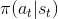
 
 * Reward: 
 
   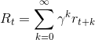

### Value Function

 The following decomposition uses [Bellman equation](https://en.wikipedia.org/wiki/Bellman_equation).

 * State value
 
   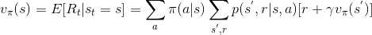
   
 * Optimal state value: 
 
   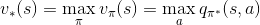
   
   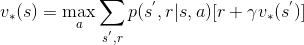
 
 * Action value
 
   
   
 * Optimal action value
 
   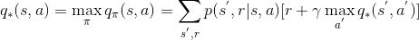
   
### Temporal Difference (TD) Learning

 * Markov Decision Process (MDP): satisfy Markov property, i.e., the future depends only on the current state and action, but not on the past  
 
 * If RL problem satisfies the Markov property, it is defined by the 5-tuple .
 
 * TD learning is usually refer to the learning methods for value function evaluation
 
 * Update rule
 
   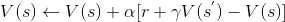
   
 * TD error
 
   
 
 * Some tabular algorithms
 
   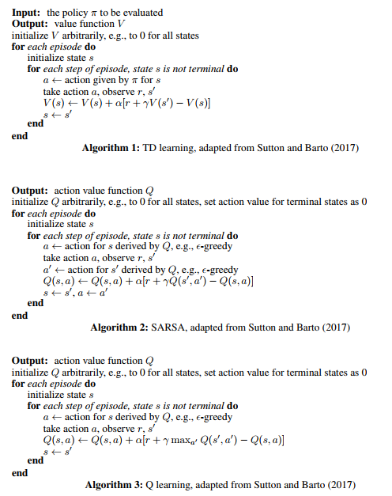
   
   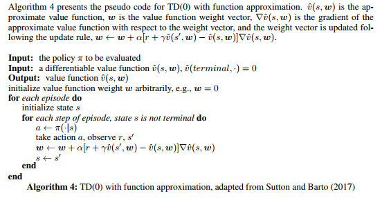
   
   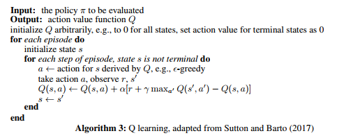
 
 * Algorithm with function approximation
 
   
 
 * **It is still unclear what is the root cause for instability. There are still many open problems in off-policy learning.**

### Policy Optimization

 * Advantage: 
 
   Here the value function V(s) is the baseline.

 * REINFORCE: an policy-based algorithm.
 
   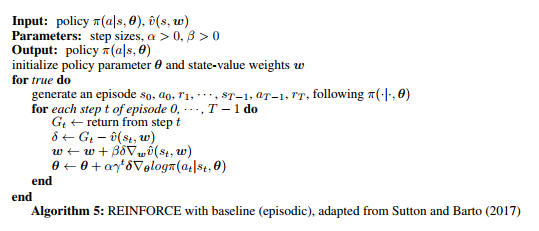
 
 * Actor-Critic: the critic updates action-value function parameters, and the actor updates policy parameters, in the direction suggested by the critic.
 
   
 
 * **The distinct difference between a "shallow" RL and a deep RL is what function approximator is used.**

### Reinforcement Learning Parlance

#### Problems

 * Prediction problem (policy evaluation): compute the state or action value function for a policy
 * Control problem: find the optimal policy
 * Planning problem: construct a value function or a policy with a model
 
#### Policy

 * On-policy: evaluate or improve the behavioural policy (same-policy)
 * Off-policy: learn an optimal value function or policy, maybe following an unrelated behavioural policy (different-policy)

#### Others

 * Exploration-exploitation dilemma: The agent needs to exploit the currently best action, yet it has to explore the environment to find better actions.
 * Model-free: The agent learn with trail-and-error from experience explicitly. The model is not known or learned from experience.
 * Online mode: Models are trained on data acquired in sequence
 * Offline mode (batch mode): Models are trained on the entire data set.
 * Bootstrapping: an estimate of state or action value is updated from subsequent estimates.

## Value Function (Draft)

### Q-Learning

#### Algorithm

 
 
#### Drawback
 
 * The maximum term cannot be easily obtained.

### Deep Q-Network (DQN)

#### Algorithm
 
 

#### Contributions

 * Stabilize the training of action value function approximation with CNN using experience replay and target network
 * Design an end-to-end RL approach, with only the pixels and the game score as inputs, so that only minimal domain 
   knowledge is required
 * Train a flexible network with the same algorithm, network architecture and hyperparameters to perform well on 
   many different tasks

### DQN Extensions

[Double DQN](https://arxiv.org/pdf/1509.06461.pdf)

[Prioritized Experience Replay](https://arxiv.org/pdf/1511.05952.pdf)

[SumTree](https://morvanzhou.github.io/tutorials/machine-learning/reinforcement-learning/4-6-prioritized-replay/)

[Dueling Architecture](https://arxiv.org/pdf/1511.06581.pdf)

## Reference 

1. Li, X. (2017). [Deep Reinforcement Learning: An Overview](https://arxiv.org/pdf/1701.07274.pdf). 
   *arXiv preprint arXiv: 1701.07274*. 

2. Watkins, C. J. C. H. & Dayan, P. (1992). [Q-Learning](https://link.springer.com/content/pdf/10.1007%2FBF00992698.pdf). 
   *Machine Learning*, 8:279-292.

3.  Mnih, V., Kavukcuoglu, K., Sliver, D., Rusu, A. A., Veness, J., Bellemare, M. G.,
    Graves, A., Riedmiller, M., Fidjeland, A. K., Ostrovski, G., Petersen, S., Beattie, C., 
    Sadik, A., Antonoglou, I., King, H., Kumaran, D., Wierstra, D., Legg, S., & Hassabis, D. (2015). 
    [Human-level control through deep reinforcement learning](https://storage.googleapis.com/deepmind-media/dqn/DQNNaturePaper.pdf). 
    *Nature*, 518(7540):529-533.

4. van Hasselt, H., Guez, A., & Silver, D. (2016a). 
   [Deep reinforcement learning with double Q-learning](https://arxiv.org/pdf/1509.06461.pdf).
   In *the AAAI Conference on Artificial Intelligence (AAAI)*.

5. Schaul, T., Quan, J., Antonoglou, I., & Silver, D. (2016). 
   [Prioritized experience replay](https://arxiv.org/pdf/1511.05952.pdf).
   In *the International Conference on Learning Representations (ICLR)*.

6. Zhou, M. (2017). 
   [Prioritized experience replay (DQN) (Tensorflow)](https://morvanzhou.github.io/tutorials/machine-learning/reinforcement-learning/4-6-prioritized-replay/).
   Retrieved from https://morvanzhou.github.io/tutorials/machine-learning/reinforcement-learning/4-6-prioritized-replay/

7. Wang, Z., Schaul, T., Hessel, M., van Hasselt, H., Lanctot, M., & de Freitas, N. (2016b).
   [Dueling Network Architectures for Deep Reinforcement Learning](https://arxiv.org/pdf/1511.06581.pdf).
   In *the International Conference on Machine Learning (ICML)*.

